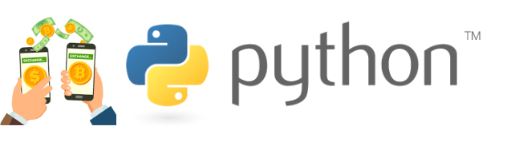

# Projeto: Cambio de Moedas

# Objetivos
Esta aplicação é destinada ao uso de um API para consulta de moedas, da biblioteca do Fixer.

  - Valores de moedas de todo o mundo
  - Consulta em tempo real
  - Conversão para valores em Reais

# Informações Gerais

  - Desenvolvedor: Juan Sobral
  - Data de início do desenvolvimento: 30/03/2019
  - Versão: 1.0.0
  - Última atualização: 30/03/2019
  
# Funcionalidades

  - Consultas em tempo real
  - Conversão de moedas
  - Principais moedas do mundo
  